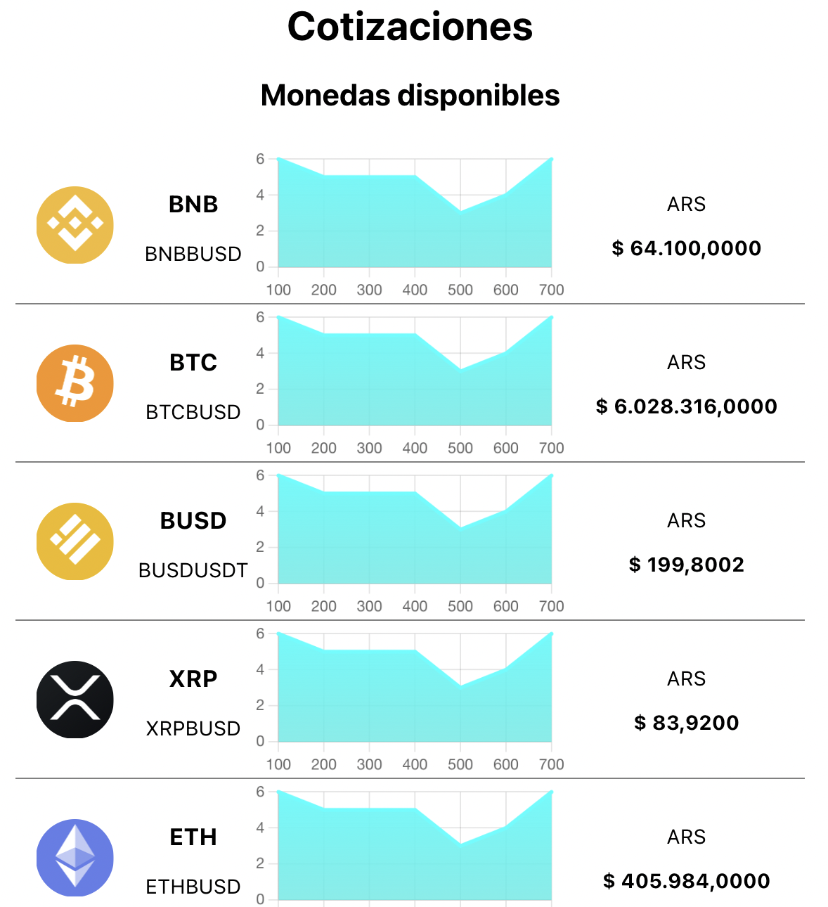

# React Project - Crypto Watcher

***

En el challenge obtengo los datos de los pares:

|         |           |          |          |          |
|---------|-----------|----------|----------|----------|
| BTCBUSD | ETHBUSD   | BNBBUSD  | LUNABUSD | SOLBUSD  |
| LTCBUSD | MATICBUSD | AVAXBUSD | XRPBUSD  | BUSDUSDT |

✅ Los datos de las cotizaciones se obtienen en tiempo real desde el websocket de binance.

✅ Los valores se muestran en moneda `ARS` tomando como constante el valor de CCL a `ARS$200`.

✅ Las cotizaciones se redondean a 4 decimales.

✅ Se realiza tratamiento especial al par `BUSDUSDT`.

